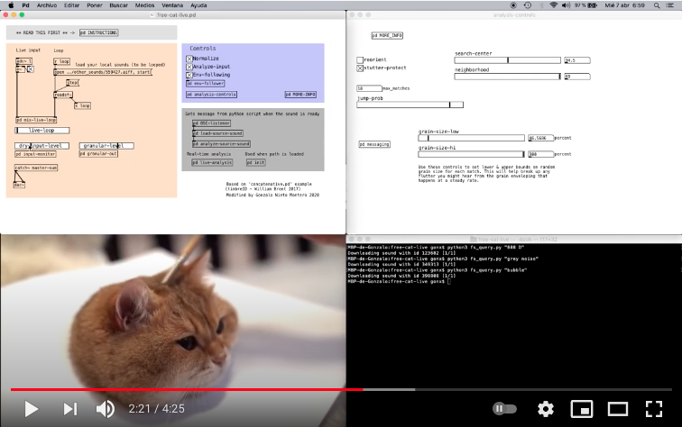

# FREE-CAT LIVE
Author: Gonzalo Nieto Montero [@gonznm](https://github.com/gonznm)

FREE-CAT LIVE is an instrument developed by Gonzalo Nieto Montero in the context of the course Computational Music Creativity of the Sound and Music Computing Master at the Music Technology Group (Universitat Pompeu Fabra, Barcelona).

FREE-CAT LIVE integrates a real-time [concatenative synthesizer](https://en.wikipedia.org/wiki/Concatenative_synthesis#:~:text=Concatenative%20synthesis%20is%20a%20technique,milliseconds%20up%20to%201%20second.) with [Freesound](https://freesound.org/). The idea is to be able to make text queries and download sounds via the [Freesound APIv2](https://freesound.org/docs/api/overview.html) in order to create an approximation of an input signal or a pre-recorded loop in a live situation. For example, you might use this if you wanted to be able to speak into a microphone and hear a version of your voice built from dog barks.

[](https://www.youtube.com/watch?v=nhlqn3-BCrI)

To achieve this, a Pure Data patch (based on William Brent's ```concatenative.pd```) performs the real-time concatenative synthesis using BFCC coefficients, while a python script run from the command line allows the user to make queries, and directly communicates with the Pd patch via OSC.

## Requirements

Tested with Python 3.7.4 and Pure Data 0.51.3 in a macOS Mojave 10.14.6 operative system.

- Pd externals (available via deken): timbreID.

- Python libraries: freesound, pydub and pythonosc.

## Setup
Once all requirements have been correctly installed, open ```free-cat-live.pd``` and follow these steps:

1) Open a terminal window from the free-cat-live folder.

2) Make a sound query by typing ```python fs_query.py "your query"``` and pressing enter. This will download the first result of your text search shorter than 10 seconds. The python script will automatically tell the Pd patch (via OSC) to analyze the new file when the download finishes. Note that the concatenative synthesis is performed only with the sound of your last query. <div style="text-align:center"></div>
3) On the left side of the Pd patch, you can activate the live input (you may need to set your audio device in Pd preferences before) or start a loop of a sound you have in your computer (change the path accordingly), or both. Control the mix between them with the ```live-loop``` slider. <div style="text-align:center"></div>
4) Adjust the level of the granular output (the approximation to your live input) and dry input so you can hear how they relate. Then try dropping the monitoring level of the dry input to 0 and see if you can hear its presence in the granular output alone.
5) Open the ```[pd analysis-controls]``` subpatch for further controls over the real-time concatenative process. <div style="text-align:center"></div>
6) More details of the process are available by clicking on the different subpatches and their respective ```[pd MORE-INFO]```.

### Bug fixing
Note that right now (07-03-2021) there is a bug that makes Pd crash after an unknown number of queries (sometimes a few, sometimes you can do a lot). It may have to do with the non real-time analysis of the source sound in Pd (```[pd analyze-source-sound]```). Feel free to contribute!


